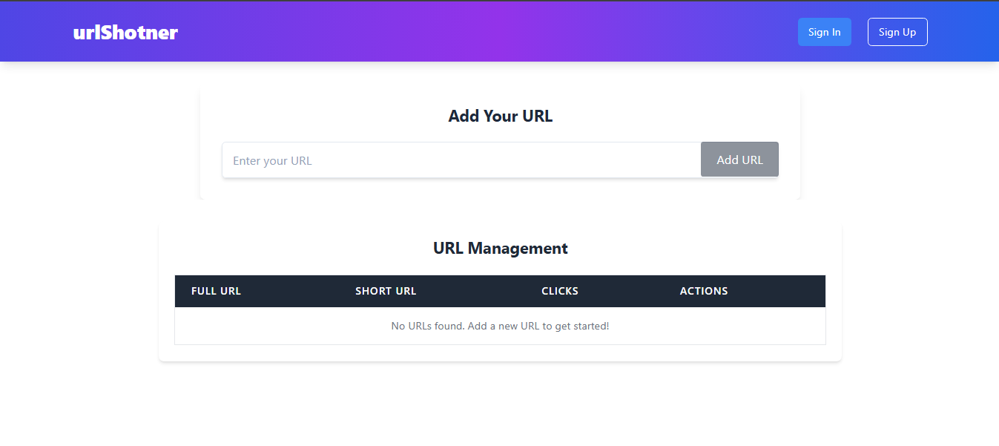

# URL Shortener with MERN Stack with TypeScript

A URL shortener application built using the MERN stack (MongoDB, Express, React, Node.js) with TypeScript. This application allows users to shorten long URLs, manage and track them. It provides a user-friendly interface for managing URLs and includes a powerful backend for URL shortening and redirection.


## Features

- **URL Shortening**: Convert long URLs into shortened, shareable links.
- **URL Management**: View, edit, and delete URLs in the management dashboard.
- **Click Tracking**: Track the number of clicks on each short URL.
- **Responsive UI**: A user-friendly, mobile-responsive frontend built with React and Tailwind CSS.

## Screenshots

Here are some screenshots of the project:




## Technologies

### Frontend
- **React**: A JavaScript library for building user interfaces.
- **TypeScript**: A statically typed superset of JavaScript for improved developer productivity and error-checking.
- **Tailwind CSS**: A utility-first CSS framework for faster UI development.
- **React Router**: A library for handling navigation and routing in React applications.

### Backend
- **Node.js**: A JavaScript runtime built on Chrome’s V8 engine for server-side applications.
- **Express.js**: A fast and minimalist web framework for Node.js.
- **MongoDB**: A NoSQL database for storing URLs and their corresponding data.
- **Mongoose**: A MongoDB object modeling tool designed to work in an asynchronous environment.

### Development Tools
- **Vite**: A modern build tool that provides fast development server and optimized build process.
- **Axios**: A promise-based HTTP client for making requests from the frontend to the backend.
- **CORS**: Middleware to enable cross-origin requests between frontend and backend.

## Installation

### Prerequisites
- **Node.js** (v16 or higher)
- **MongoDB** (local or cloud-based)

### Steps

1. Clone the repository:

    ```bash
    git clone https://github.com/inaveed-git/mern-url-shortener.git
    ```
    
    2. Navigate to the project folder:

    ```bash
    cd mern-url-shortener
    ```
    3.Navigate to the backend directory and install the required packages:
    ```bash
    cd backend
   npm install
   npm run dev
   ```
   4.Set Up Environment Variables
   ```bash
   Rename the .env.simple file to .env:
   Open the .env file and add your MongoDB connection string:
   MONGO_URI=your_mongodb_connection_string
   ```
   5.Navigate to the frontend directory and install the required packages:
   ```bash
   cd frontend
   npm install
   npm run dev
   ```
   
## Usage

Once the application is running, you can use the following features:

- **Create a short URL**: Enter a long URL in the input field to generate a shortened URL.
- **Manage URLs**: View, edit, and delete your short URLs in the dashboard.
- **Track clicks**: View how many times each URL has been clicked.

## API Endpoints

- **POST** `/api/shorten`: Create a short URL.
- **GET** `/api/get/:shortURL`: Redirect to the original URL based on the short URL.
- **PUT** `/api/update/:id`: Update a short URL.
- **DELETE** `/api/delete/:id`: Delete a short URL.


### Keywords
`URL Shortener`, `MERN Stack`, `Node.js`, `Express`, `React`, `TypeScript`, `MongoDB`, , `Full-Stack Web Development`

## License
This project is licensed under the MIT License - see the [LICENSE](LICENSE) file for details.

   


